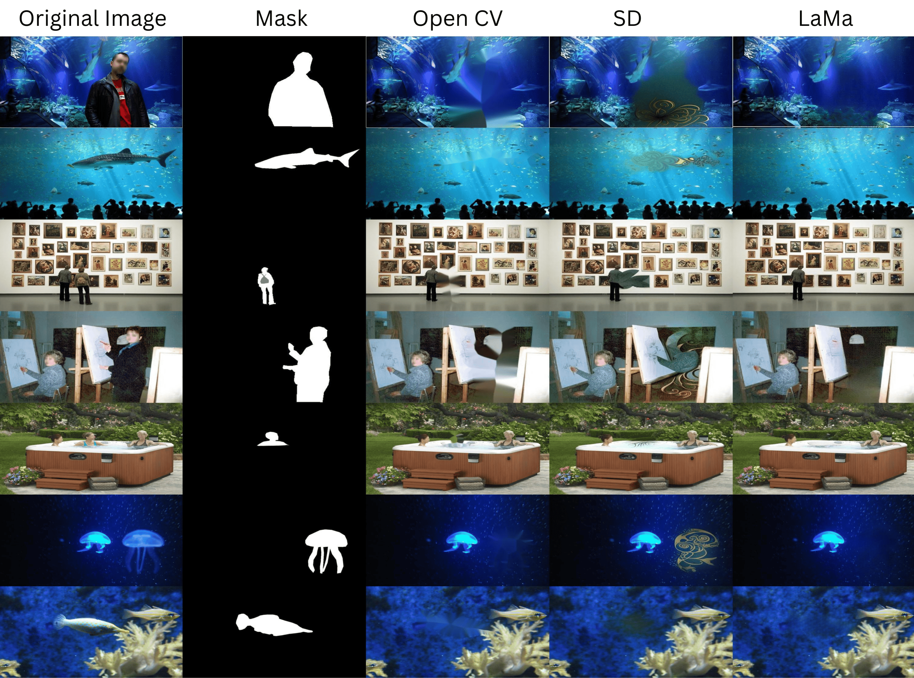

# Project: AI Inpainting - Generative Models vs. Traditional Methods

#### 📝 Description  
Developed a study to explore how modern generative AI transforms image inpainting compared to classic techniques. By benchmarking **LaMa** and **Stable Diffusion** against the traditional **Telea** method, the research reveals striking improvements in both performance and visual quality.

#### 🛠️ Technologies Used  
- Python  
- PyTorch  
- Stable Diffusion  
- LaMa  
- OpenCV  
- Pandas  

#### ⚠️ Challenges  
- Image preparation  
- Mask improvement  
- Model evaluation  
- Bootstrapping  
- Significance testing  

#### 🤖 Models Used  
- **LaMa**  
- **Stable Diffusion** (Hugging Face)  
- **Telea** (OpenCV)  

#### 📊 Key Findings  
- **Superior Performance:** AI-based models (LaMa & Stable Diffusion) outperform Telea by approximately 14%.  
- **Mask Size is Critical:** The size of the missing area is the most influential factor affecting inpainting quality.  
- **Model Suitability:**  
  - **Stable Diffusion** excels with large masks, though it may sometimes generate "hallucinations."  
  - **LaMa** is optimal for small-to-medium masks, but struggles with larger missing areas.  
- **Future Directions:** Enhancing model efficiency and reducing unwanted object generation will further improve inpainting quality.

#### ❓ What is Image Inpainting?  
- **Definition:** Restoring missing, damaged, or removed parts of an image.  
- **Applications:** Restoration, enhancement, and object removal.

#### 🔍 Results and Model Comparison

| Mask Size      | Model                 | Improvement to Baseline (%) | Ranking |
|----------------|-----------------------|--------|-----------------------------|---------|
| **Small Mask** | LaMa                  | +0.17%                      | 1       |
|                | Telea (Baseline)      | 0%                          | 2       |
|                | Stable Diffusion      | -21.48%                     | 3*      |
| **Medium Mask**| LaMa                  | +11.67%                     | 1*      |
|                | Telea (Baseline)      | 0%                          | 3*      |
|                | Stable Diffusion      | +3.83%                      | 2*      |
| **Large Mask** | LaMa                  | +14.27%                     | 2*      |
|                | Telea (Baseline)      | 0%                          | 3*      |
|                | Stable Diffusion      | +18.78%                     | 1*      |
| **Overall**    | LaMa                  | +14.64%                     | 1*      |
|                | Telea (Baseline)      | 0%                          | 3*      |
|                | Stable Diffusion      | +13.40%                     | 2*      |

---

Explore the evolving landscape of image inpainting—where AI meets creativity and precision!  

